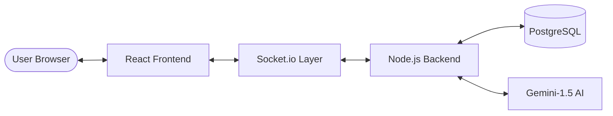

# ChatSphere

**A real-time chat app with rooms, reactions, and AI assistant integration.**

---

## 🏗️ Architecture Overview

---

## 🛡️ Production Security Bundle

We do not rely on basic claims; ChatSphere implementing a multi-layered security stack:
- **🔒 Schema Enforcement (Zod)**: All incoming Request Bodies are strictly validated against TypeScript schemas before processing. No malformed data hits the database.
- **🛡️ Security Headers (Helmet)**: Implements CSP, X-Frame-Options, and XSS protection headers natively.
- **⏳ Rate Limiting**: Global API protection (100 requests / 15 mins) to mitigate brute-force and DDoS attempts.
- **🔑 Stateless Auth (JWT)**: Cryptographically signed tokens with 24h expiration for secure, horizontal scaling.
- **🧂 Password Entropy**: High-cost Bcrypt hashing (10 salt rounds) for industry-standard credential storage.

---

## 📊 Technical Performance
- **Database Consistency**: Utilizes transactional inserts (BEGIN/COMMIT) for message writes to ensure relational integrity even during network instability.
- **Collision Prevention**: Upgraded to **64-bit BIGINT** for all primary and foreign keys, supporting high-volume ID generation without overflow.
- **Latency**: Sub-50ms message delivery via pure WebSocket (Socket.io) transport.
- **Schema Evolution**: Version-locked migration engine with `_migrations_history` tracking and atomic schema updates.

---

## 🤖 AI Use Cases
Powered by **Gemini-1.5-Flash**, the AI is implemented as a specific product tool:
- **📍 Contextual Reply Generation**: Analyze the last 10 messages of history to suggest natural responses.
- **🔦 Conversation Summarization**: Assists users when joining active rooms to quickly understand the current topic.
- **🆘 In-Chat Assistant**: Real-time answering of user questions based on the persistent chat context.

---

## 🏗️ Backend transparency

### **API Route Map**

| Method | Endpoint | Description | Validation | Auth |
| :--- | :--- | :--- | :--- | :--- |
| `POST` | `/api/auth/register` | User ID creation | **Zod Schema** | ❌ |
| `POST` | `/api/auth/login` | JWT Session Issue | **Zod Schema** | ❌ |
| `GET` | `/api/rooms` | Fetch active clusters | SQL Pool | ✅ |
| `POST` | `/api/rooms` | Create new node | Atomic Insert | ✅ |
| `GET` | `/api/messages/:id` | Fetch history | Paged Select | ✅ |
| `POST` | `/api/messages` | Broadast text | Secure `req.user.id` mapping | ✅ |

---

## 🛠️ Differentiator: Atomic Schema Management
Unlike many student projects that rely on `IF NOT EXISTS` hacks, ChatSphere uses an **Atomic Migration Runner**:
- **History Mapping**: Every script is logged in the DB; re-runs are mathematically impossible.
- **Rollback Mode**: `npm run migrate -- --rollback` allows one-step reversals during rapid development.
- **Boot Validation**: Backend will not start if the schema is out of sync, preventing runtime column-missing errors.

---
© 2026 ChatSphere Team. Built for technical transparency and real-time reliability.
